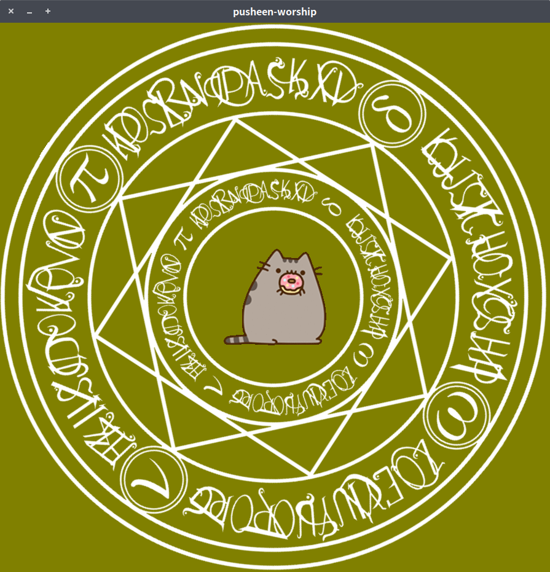

# pusheen-worship
> In pusheen, we trust.



# Dependencies
* `qt5`
* `qt5-qtquick`
* `qt5-qtquickcontrols`
* `qt5-qtgraphicaleffects`

# Usage
```shell
dnf install qt5 qt5-qtquick1 qt5-qtquickcontrols qt5-qtgraphicaleffects
# Fedora environment

git clone https://github.com/bobby1030/pusheen-worship.git && cd ./pusheen-worship
# clone this project into local

make
# build this project

./pusheen-worship